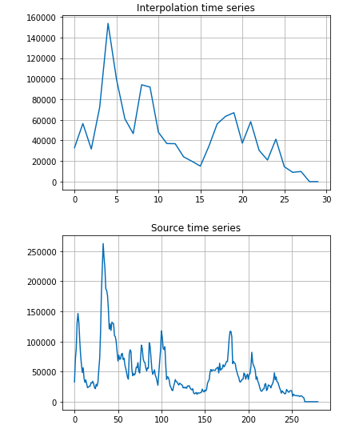

# TSeries

Данная утилита немного упрощает работу с временными рядами

Часто в приложениях встречаются задачи на работу с временными рядами. Практически всегда измерения заданы за различные 
участки времени. Перед исследователями встаёт задача: каким образом выравнять длины временных интервалов так, чтобы все 
временные ряды были одинаковой длины и образовывали матрицу. 

Данную задачу можно эффективно решить с помощью одного решающего дерева (НЕ случайного леса). Одно решающее дерево 
позволяет переобучиться и максимально точно передать те данные, хранит исходный сигнал. Таким образом, мы легко получаем
все промежуточные значения. 

Данная задача называется **интерполяцией** и может быть решена одним из стандартных пакетов.

При этом, мы используем минимум пользовательского кода, который крайне просто пишется и читается. Здесь минимум 
граничных условий и практически нет нюансов. 

Важно отметить, что иногда требуется сжимать данные. Это легко корректируется с помощью задания числа отсчётов.

Пример:

# TSeries

This utility slightly simplifies the work with time series

Applications often include tasks for working with time series. Measurements are almost always specified for different
sections of time. Researchers are faced with the task of how to align the lengths of time intervals so that all the 
time series were of the same length and formed a matrix.

This problem can be effectively solved using a single decision tree (NOT a random forest). One decisive tree allows you 
to retrain and transmit the data as accurately as possible, stores the original signal. Thus, we easily get all 
intermediate values.

This task is called ** interpolation ** and can be solved with one of the standard packages.

At the same time, we use a minimum of custom code, which is extremely easy to write and read. Here the minimum
boundary conditions and practically no nuances.

It is important to note that sometimes data needs to be compressed. This is easily corrected by specifying the number of
 samples.
 
Example:

